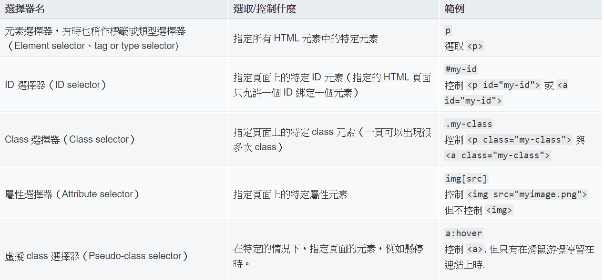

# CSS 
塑造網站的特殊風格。例如這段文字要用一般的黑色，或是改用紅色標明重點？某段重要內容應該置於畫面的何處？想用什麼背景圖片及顏色裝飾你的網站？ 
建立一個```css```file並打上 
```
    p{
        color: red; 
    }
``` 
```p``` means paragraph. 
* External Stylesheet 

    並放置在```html```中的```<head>```之中, ```<link href = "../css/style.css" rel="stylesheet" type="text/css">``` 

* Internal Stylesheet 

    直接將css程式碼放在```<head>```中並用```<style>```包裝起來 
    ```
        <style>
            p{
                color: red; 
            }
        </style>
    ```

* Inline styles 

    Embeded in the HTML element using ```style``` attribute. Do not do this unless you have to.  
    ```
        <p style="color:red;">ABC</p> 
    ```

## Analysis 
```
    p{
        color: red; 
    }
``` 
The code above is the so-called **rule set**(規則集). 
```<p>``` is a *selector*, ```color``` is a *property*, the ```red``` is *property value* and ```color : red``` is the *declaration*. 

* selector 

    The tag of the html elements. In this case is ```<p>``` means the all the paragraph tag will be overrided by this rule set. 

* declaration 
    
    ```color:red``` specifies the pattern of the elements. 

* Properties 
* Property values 

```
    * 每一個規則當中，除了選擇器名稱以外，其他都必須被大括號（{}）給包住.
    * 在每一個宣告裡面，屬性跟屬性值之間必須用冒號(:) 做區分。
    * 在每一個規則裡面可以包含有許多宣告，但不同的宣告之間必須使用分號 (;) 來區分。
```

### Multiple selector 
```
    p, li, h2{
        color: red; 
    }
```
All of the selector above are *element selector* until now. 
 


### Others 
Specific the class 
```
    .special { 
        color : blue; 
        font-weight : bold; 
    }
```
This means that any elements that contains the class name ```special``` will use the style that defined above. 

```
    li.special { 
        color : blue; 
        font-weight : bold; 
    } 
```
This means that target any ```li``` element that a class of ```special``` will use the style that definde above. 

```
    li em { 
        color : blue; 
        font-weight : bold; 
    } 
```
This means that this selector ```li``` will select any ```<em>``` element that is inside an ```<li>```. 


```
    h1 + p { 
        color : blue; 
        font-weight : bold; 
    } 
```
This means that targeting the ```<p>``` elements that follow the ```<h1>``` directory. 


```
    body h1 + p .special {
        color: yellow;
        background-color: black;
        padding: 5px;
    }
```
This will style any element with a class of special, which is inside a ```<p>```, which comes just after an ```<h1>```, which is inside a ```<body>```. 


## How Does CSS Actually Do? 
[REFERENCE](https://developer.mozilla.org/en-US/docs/Learn/CSS/First_steps/How_CSS_works)<br> 
